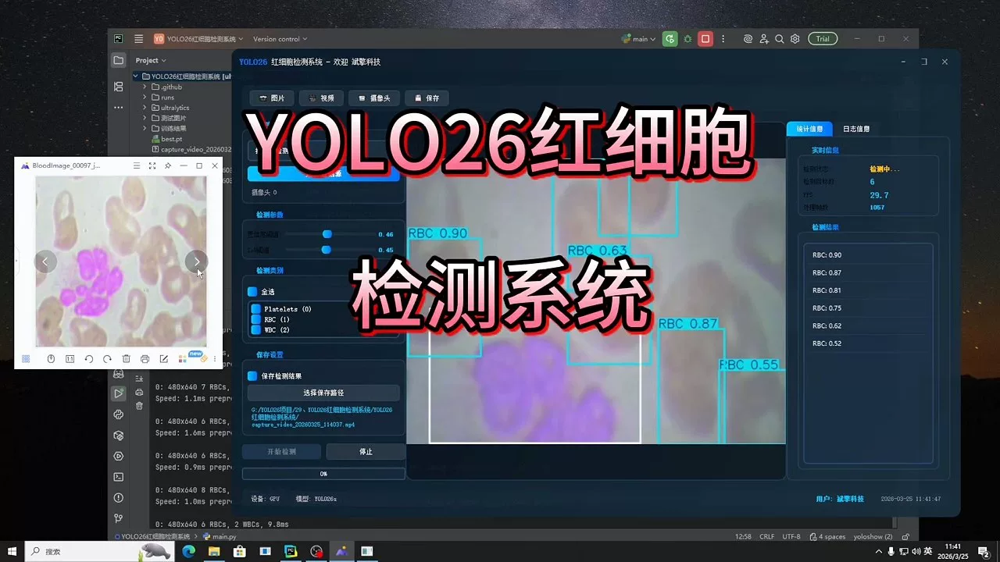
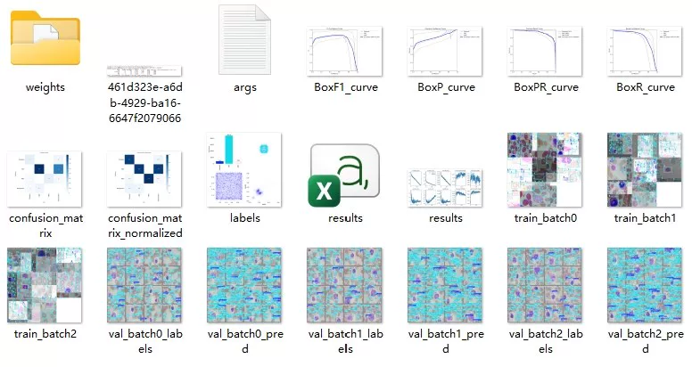
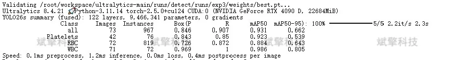
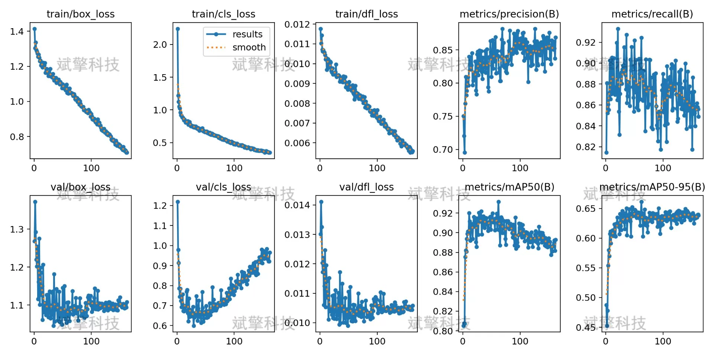
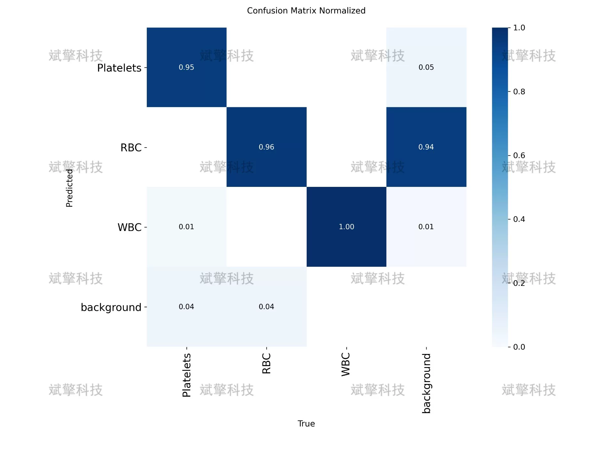
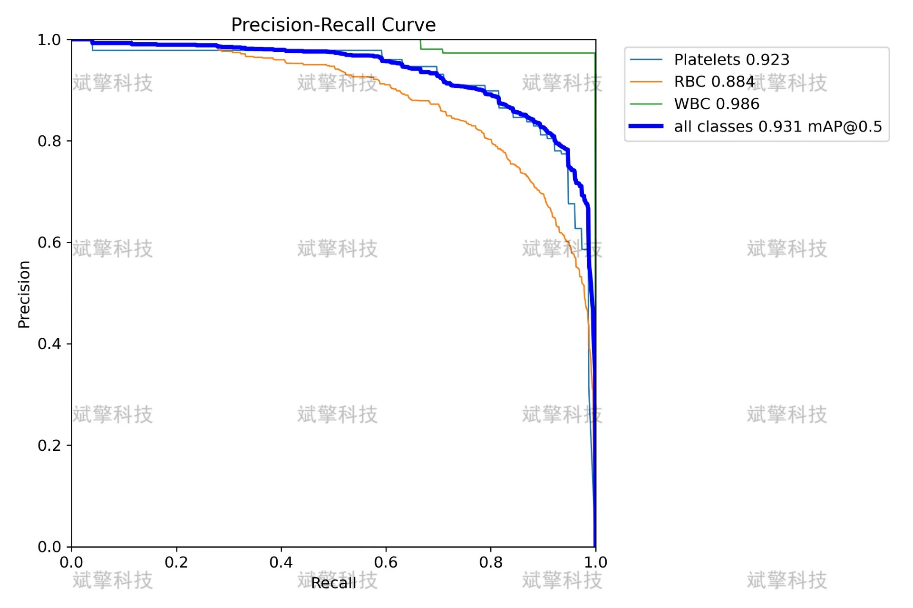
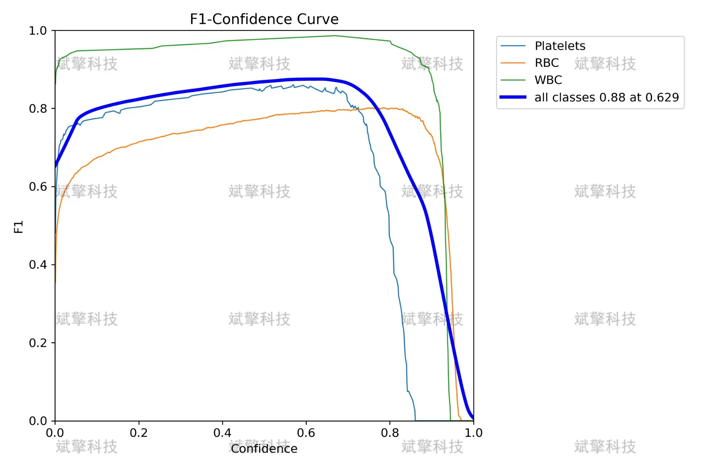
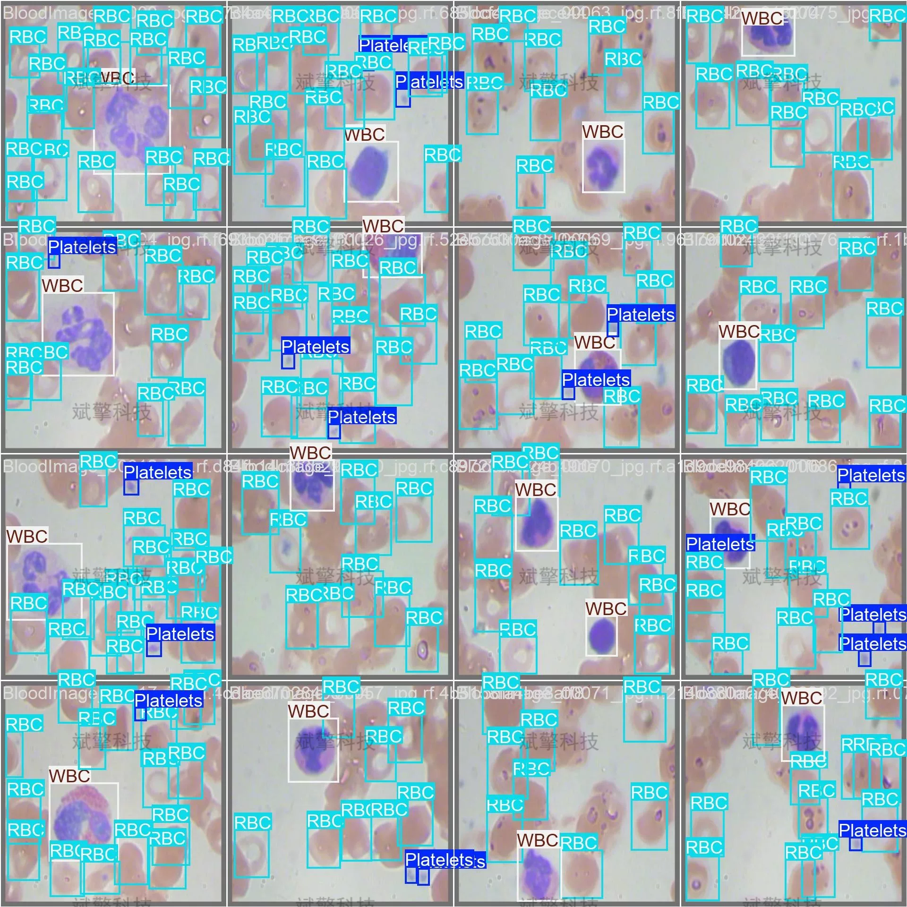
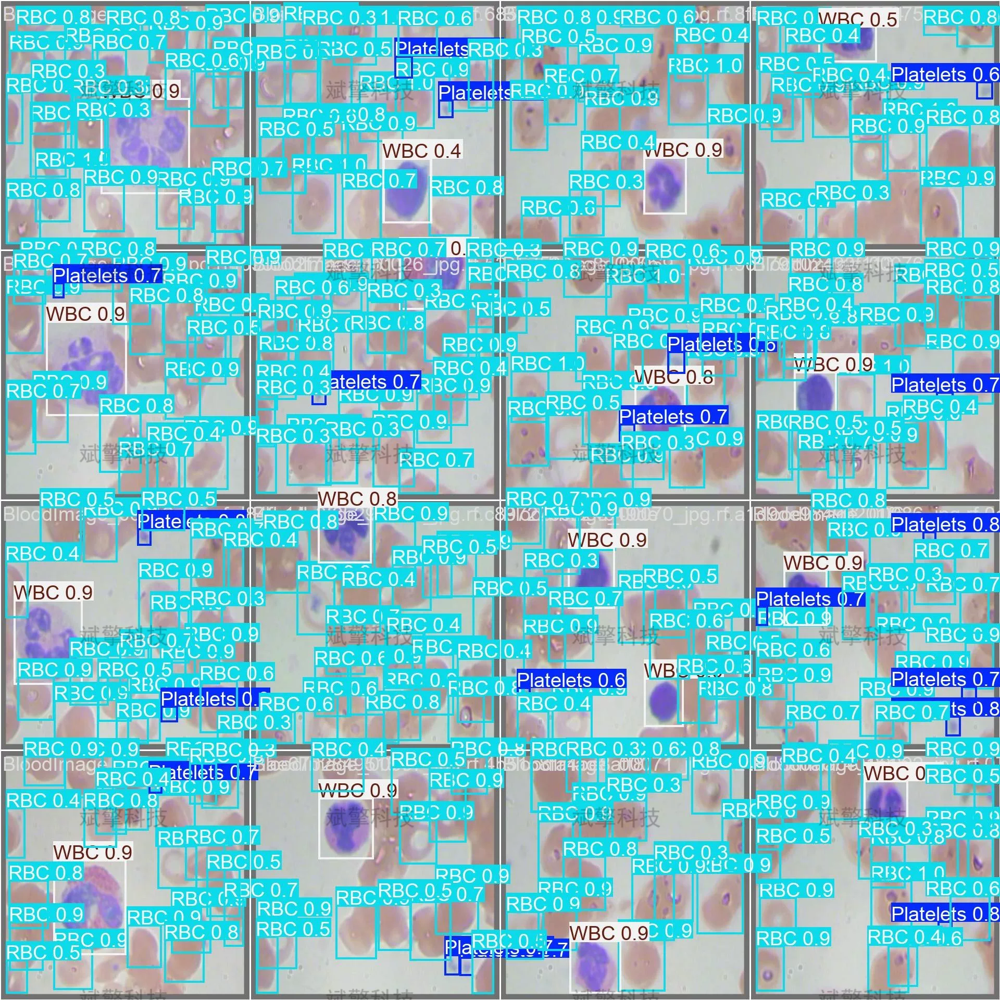

# YOLOv26 Hematology Detection System | Dataset

## Body

YOLO26 Blood Cell Detection System | Completely Covering Platelets, Red Blood Cells, and White Blood Cells: YOLO26 Blood Cell Detection System

This study is based on the YOLO26 object detection algorithm to build an automatic system for detecting red blood cells in blood cell images. The system can identify and locate platelets (Platelets), red blood cells (RBC) and white blood cells (WBC). A total of 874 labeled blood cell images were used in the experiment, including 765 training set, 73 validation set and 36 test set, covering more than 900 instances of three types of cells.

The model achieved detection performance with mAP50 of 0.931 and mAP50-95 of 0.662 on the validation set, with white blood cell detection being the most effective (mAP50=0.986), followed by red blood cells (mAP50=0.884) and platelets (mAP50=0.923). The system can perform inference on a single image in just 1.2ms, demonstrating real-time detection capabilities. Research indicates that the YOLO26 algorithm has promising application prospects for blood cell detection tasks, providing auxiliary support for clinical hematology analysis.

The RBC represents red blood cells, WBC stands for white blood cells. The training set consists of 765 images (87.5%), the validation set contains 73 images (8.4%), and the test set includes 36 images (4.1%).

Free remote installation appointments. Unsuccessful, full refund.
Purchase includes the following resources (auto-unlocked by Baidu Pan)
YOLO recognition detection project complete source code
YOLO format dataset
Training code + UI interface code
Trained model + result images
Software installer package
Add WeChat to make a remote installation appointment (shown automatically after purchase) —— Unsuccessful, full refund

⚙️ Core Function Modules
�� Detection Capabilities
    Image Detection: Upon upload, returns detection boxes + category information.
    Video Detection: Supports video files, precise analysis of frames-by-frame.
    Camera Real-Time Detection: Attaches USB cameras to achieve dynamic monitoring.

️ Interaction and Control
    Target Filtering: Choose one or more categories for detection freely.
    Parameter Real-Time Adjustment: Adjustable confidence threshold & IoU threshold, flexibly control accuracy.
    Result Save: One-click save of image/video/camera detection results.

User Login and Registration: Supports password strength detection + Encrypted storage
Logging: Auto-records operation and error information (with timestamp)

## Images

## Payment

Here is a pay link on Stripe ( https://buy.stripe.com/3cs8yP7sY87d0vu9AB ). Please contact me lonlonago@foxmail.com after funding $89, and I will send you a complete data files , thank you!

